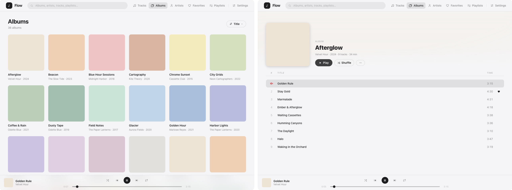
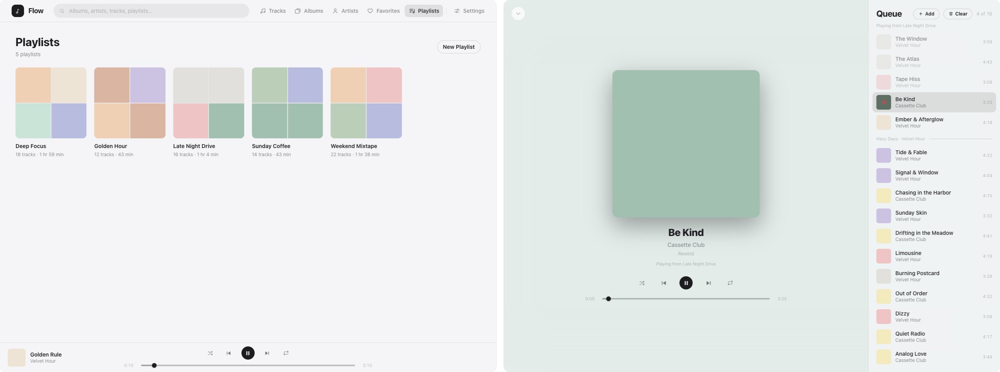
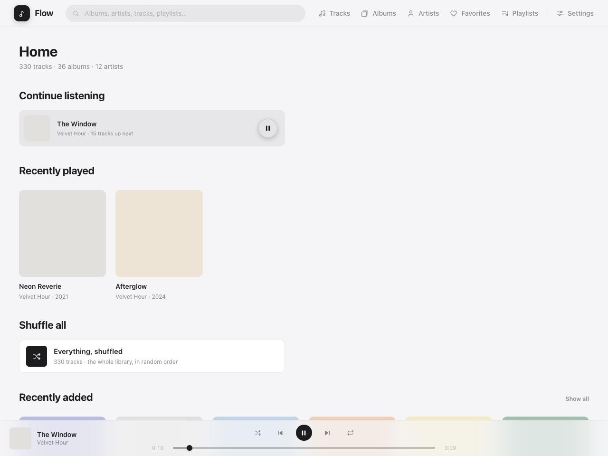
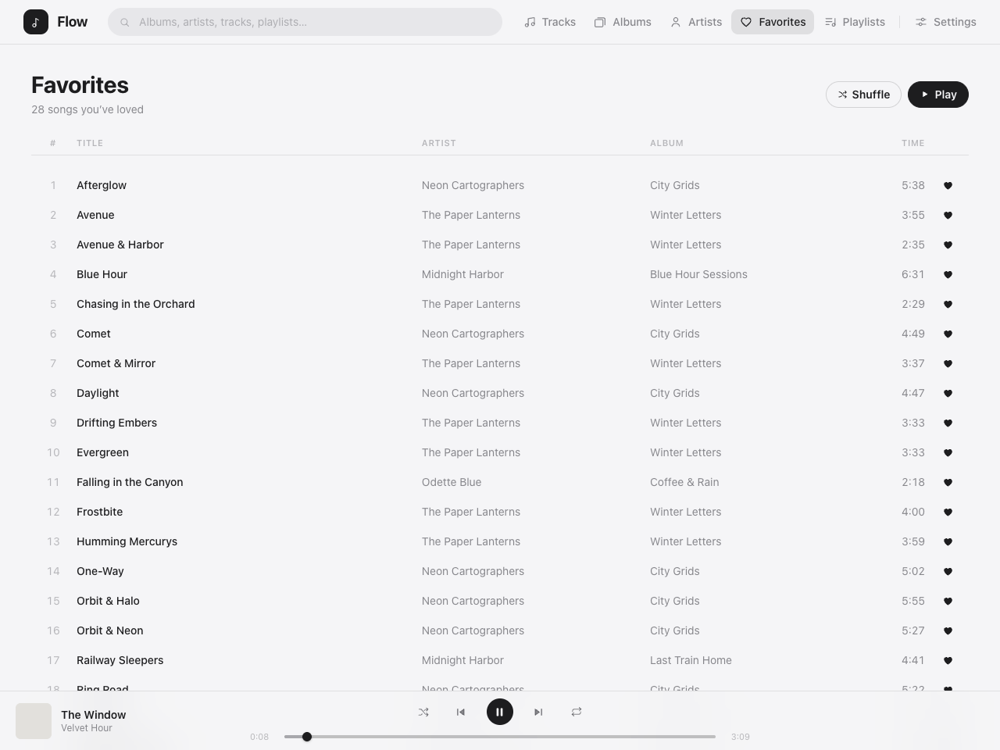
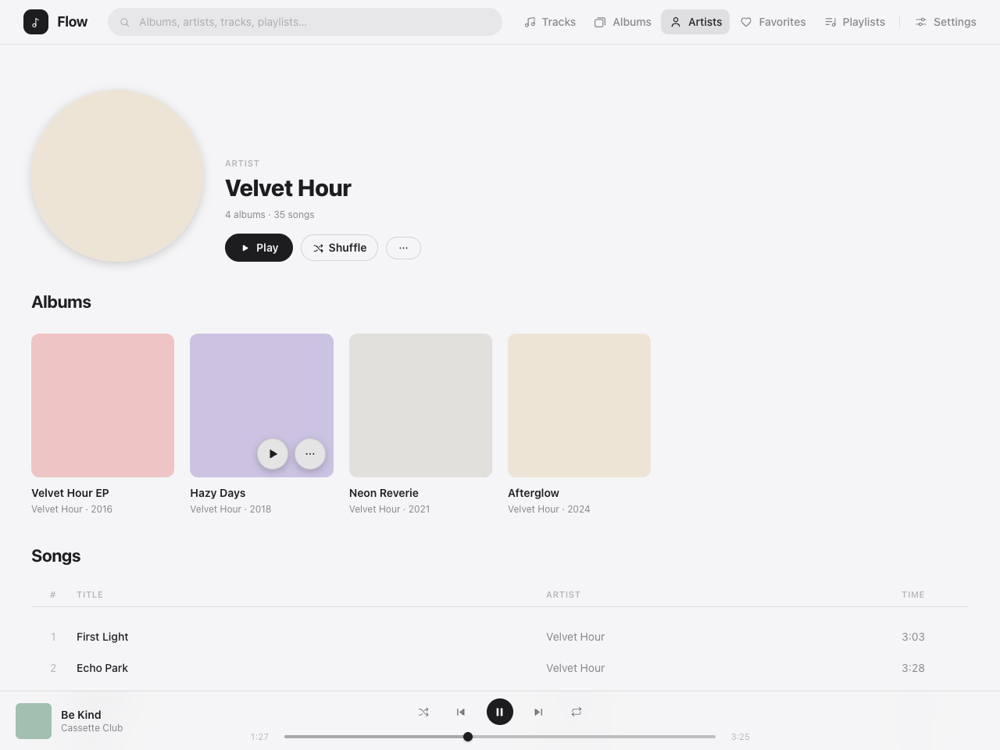
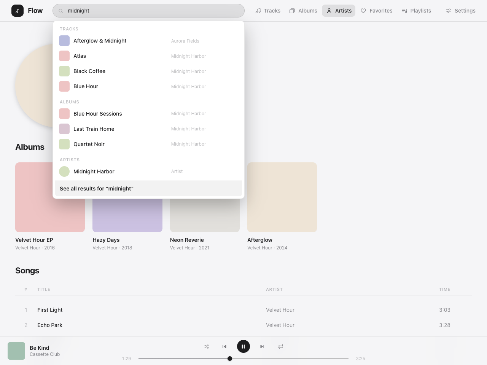

<div align="center">

<picture>
  <source media="(prefers-color-scheme: dark)" srcset="assets/logo-dark.svg">
  
</picture>

<h1>Flow</h1>

<p>
  <strong>Your music, streamed from your own server.</strong><br>
</p>

<p>
  <a href="https://github.com/polius/Flow/actions/workflows/ci.yml"></a>
  <a href="https://github.com/polius/Flow/actions/workflows/release.yml"></a>
  <a href="https://github.com/polius/Flow/releases"></a>
  <a href="https://hub.docker.com/r/poliuscorp/flow"></a>
  <a href="LICENSE"></a>
</p>

<picture>
  <source media="(prefers-color-scheme: dark)" srcset="assets/app-dark.png">
  
</picture>

<picture>
  <source media="(prefers-color-scheme: dark)" srcset="assets/app-2-dark.png">
  
</picture>

</div>

## What it does

Flow turns a folder of music files into a clean, fast web player — albums, artists, playlists, favorites, search — on any device, at home or away.

- **Yours** — your files stay exactly where they are. Flow only reads them.
- **Simple** — drop files in a folder. That's the whole workflow.
- **Fast** — a real index, instant search, and playback that starts right away.
- **One container** — a single Docker service to run and update.

<details>
<summary>More screenshots</summary>

<p>
  
  
  
  
</p>

</details>

## Quick demo

Want to see it with music before adding your own? Run a throwaway demo instance — a small library included:

```bash
docker run --rm -e DEMO=true -p 8080:8080 poliuscorp/flow
```

Then open `http://localhost:8080` in your browser.

> **Note:** Demo data lives inside the container and disappears when it stops. For a real installation, see [Quick start](#quick-start).
>
> **The demo tracks are silent** — they're generated stand-ins, not real music. Playback, the queue, loudness matching — everything behaves exactly as it will with your own files.

## Quick start

Requires [Docker](https://docs.docker.com/get-docker/).

1. Download [`docker-compose.yml`](docker-compose.yml).
2. Start:

```bash
docker compose up -d
```

Flow creates a `flow` folder (with `music/` inside) next to the compose file on first start.

3. Open `http://localhost:8080` and drop your music into `flow/music/` — see below.

## Adding music

Copy your audio files (MP3, FLAC, M4A, OGG) anywhere inside `flow/music/` — the folder is created for you on first start. Any structure works. Flow walks the whole folder, so files in subfolders, in one big pile, or right at the root are all fine:

```
flow/
└── music/                  ← anything in here gets scanned
    ├── My Mixtape.mp3
    ├── Artist Name/
    │   └── Album Name/
    │       └── 01 - Song.mp3
    └── Some Other Song.flac
```

**Albums and artists come from your files' tags**, not from folder names. Untagged files still get indexed — a name like `01 - Song.mp3` is read as track 1, "Song", and anything else uses the filename as the title. For proper albums, artwork, and artist pages, make sure your files are tagged.

New files are picked up automatically. You can also trigger a scan any time from **Settings → Library**. To remove music, delete the files and rescan.

## Login (optional)

By default, anyone on your network can open Flow. Want a password? Go to **Settings → Access → Turn On** and set one — from then on, Flow asks for it before opening.

Changed your mind? **Settings → Access → Turn Off** removes the password again.

## Environment variables

| Variable | Details |
| --- | --- |
| `DEMO` | Set to `true` to pre-load a demo library on first start (see [Quick demo](#quick-demo)) |

## License

Released under the [MIT License](LICENSE).
