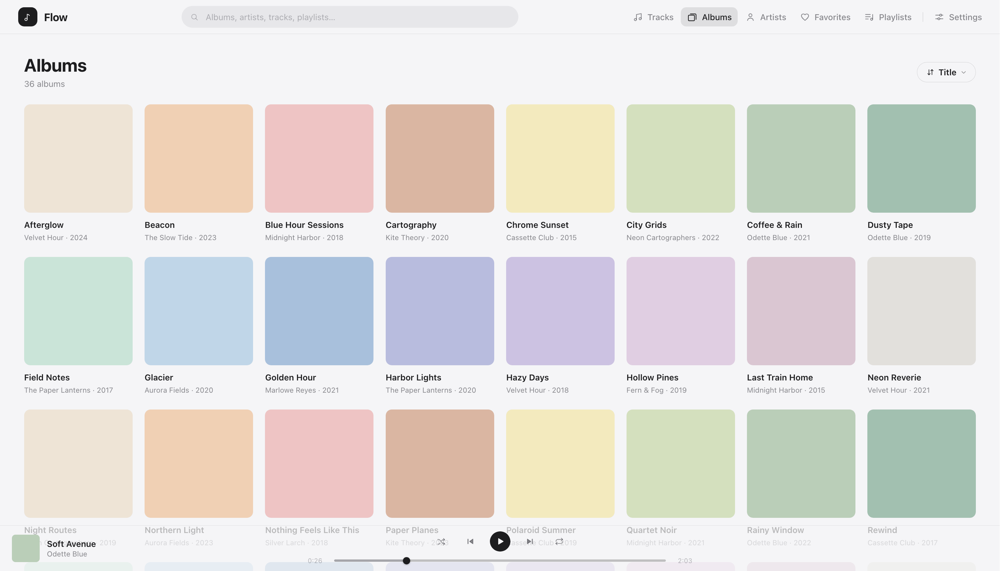

<div align="center">

<picture>
  <source media="(prefers-color-scheme: dark)" srcset="assets/logo-dark.svg">
  
</picture>

<h1>Flow</h1>

<p>
  <strong>Your music, streamed from your own server.</strong><br>
</p>

<p>
  <a href="https://github.com/polius/Flow/actions/workflows/ci.yml"></a>
  <a href="https://github.com/polius/Flow/actions/workflows/release.yml"></a>
  <a href="https://github.com/polius/Flow/releases"></a>
  <a href="https://hub.docker.com/r/poliuscorp/flow"></a>
  <a href="LICENSE"></a>
</p>




</div>

## Quick demo

Want to try it out? Run:

```bash
docker run --rm -e DEMO=true -p 8080:8080 poliuscorp/flow
```

Then open http://localhost:8080 in your browser.

> **The demo tracks are silent.** They're generated placeholder files, not real music. Everything else works exactly as it does with your own files.

## Set up

1. Download [`docker-compose.yml`](docker-compose.yml).

2. Start the container:

   ```bash
   docker compose up -d
   ```

On first start, a `flow/` folder is created next to the compose file, with a `music/` subfolder where you can add your music files.

> Root-owned host folders (common on NAS) work as-is: the container prepares its data folder on start and then runs unprivileged — no manual `chown` needed.

## Adding music

Copy your audio files (`MP3`, `FLAC`, `M4A`, or `OGG`) anywhere inside `flow/music/`.

Any folder structure works. Files can be organized into artist and album folders, kept in a single directory, or placed directly in the root:

```text
flow/
└── music/
    ├── My Mixtape.mp3
    ├── Artist Name/
    │   └── Album Name/
    │       └── 01 - Song.mp3
    └── Some Other Song.flac
```

**Albums and artists are read from your files' tags, not their folder names.**

Untagged files are still indexed. For example, a file named `01 - Song.mp3` is interpreted as track 1 with the title `Song`; otherwise, the filename is used as the title.

For the best experience — including albums, artwork, and artist pages — make sure your files have proper metadata.

New files are picked up automatically. You can also trigger a scan at any time from **Settings → Library**.

To remove music, delete the files and run a scan.

## License

Released under the [MIT License](LICENSE).
